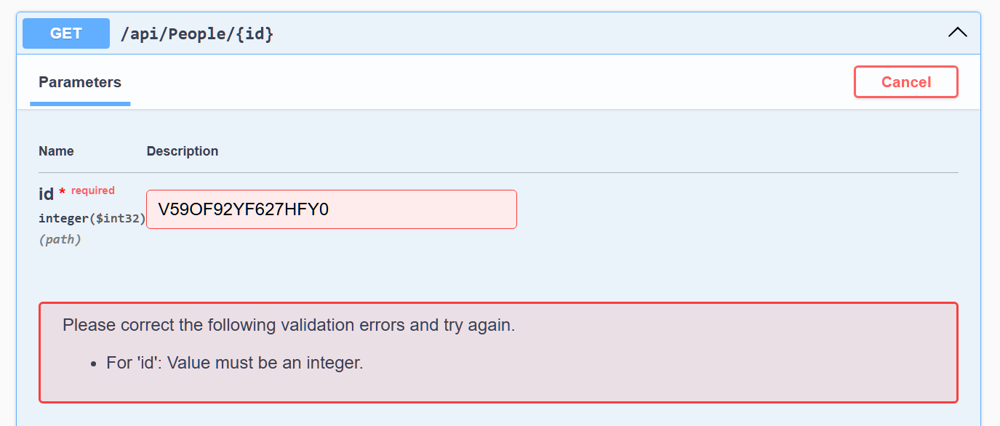

# Connecting a Web API to a Console Application

Creation of a .NET solution that contains at web API and a console application that consumes data from the API

> This is all I have for the README at this time because the last method GetPerson did not work.

```cs
HttpResponseMessage singleResponse = await client.GetAsync("/api/People/XU7BX2F8M5PVZ1EF");
// I think response should be singleResponse here, not response. Otherwise, it will always be true because the first response was successful.
if (response.IsSuccessStatusCode)
{
    string jsonResponse = await singleResponse.Content.ReadAsStringAsync();

    var person = JsonSerializer.Deserialize<Person>(
        jsonResponse,
        new JsonSerializerOptions { PropertyNameCaseInsensitive = true }
    );
    // I'm not getting Name or Language or Version. I think the problem is that the property names in the JSON response don't match the property names in the Person class. I need to check the JSON response and make sure that the property names match.
    // 🚫 Swagger shows this error on the page:
    //      For 'id': Value must be an integer.
    // But it is defined as a string in the Person class. I need to change the type of Id to int in the Person class.
    Console.WriteLine($"NAME: {person.Name} speaks {person.Language} {person.Version} {person.Id}");
}
else
{
    Console.WriteLine("------------------------------");
    Console.WriteLine($"Error: {singleResponse.StatusCode}");
    Console.WriteLine(await singleResponse.Content.ReadAsStringAsync());
}
```

- NOTE: I tried different Id values
- I added `-----------` as a separator for the console output.
- When I have `if (response.IsSuccessStatusCode)` I get `NAME:  speaks  0`
  - I added _NAME:_ because all that was printing was "speaks"
- I think `response` should be `singleResponse` but when I change it I get the following error:

```
Error: BadRequest
{"type":"https://tools.ietf.org/html/rfc9110#section-15.5.1",
"title":"One or more validation errors occurred.",
"status":400,
"errors":{
    "id":["The value 'XU7BX2F8M5PVZ1EF' is not valid."]},
"traceId":"00-509154f22ad1305c1d49a633d35b4243-5969de8df5376023-00"}
```

Swagger shows that Id needs to be an integer but it is defined as a string everywhere?!?

DAmn, in GetPerson I had `id` as an `int` so I changed it to `string` but I'm still getting the same error



> NOTE: I have to redo this because I forgot to stop and restart the API server when I switched id from `int` to `string` - it works now
